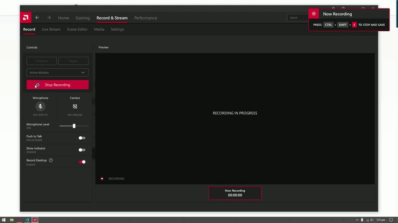

# ChronicScope — Landing Page

**[View Live Site →](https://your-live-url-here)**

A modern, fully responsive landing page for **ChronicScope**, a chronic pain detection mobile app built with Flutter. This web app is built as a Final Year Project (FYP) showcase site targeting Pakistani healthcare awareness.

---

## What is ChronicScope?

ChronicScope is a research-backed mobile app that helps users self-assess chronic pain conditions such as **Fibromyalgia** and **Neuropathic Pain** using clinically validated questionnaires (MPQ and DN4). This website introduces the app, explains how it works, and provides a direct APK download link.

---

## Screenshots



---

## Tech Stack

| Technology | Purpose |
|---|---|
| React 18 | UI library |
| Vite | Build tool & dev server |
| Tailwind CSS | Utility-first styling |
| Framer Motion | Page & scroll animations |
| Lucide React | Icon system |
| React Context API | Dark/light theme state |

---

## Key Features

- **Dark / Light mode** — persisted in `localStorage`, respects system preference
- **Smooth animations** — scroll-triggered entrance animations via Framer Motion
- **Fully responsive** — mobile, tablet, and desktop layouts
- **9 sections** — Hero, About, Features, How It Works, Why It Matters, Download, About Project, Future Plans, Footer
- **SEO-ready** — semantic HTML and meta tags

---

## Project Structure

```
src/
├── components/       # One file per section (Header, Hero, Features, …)
├── context/
│   └── ThemeContext.jsx   # Global dark/light mode
├── App.jsx
└── index.css         # Tailwind base + custom globals
```

---

## Getting Started

**Prerequisites:** Node.js 16+

```bash
# Install dependencies
npm install

# Start dev server (http://localhost:5173)
npm run dev

# Production build
npm run build
```

---

## Color Scheme

| Mode | Primary | Accent | Background |
|------|---------|--------|------------|
| Light | `#02394E` (dark teal) | `#DBEE9C` (lime) | `#F8F9FA` |
| Dark | `#1E1E1E` | `#DBEE9C` | `#121212` |

---

## Disclaimer

ChronicScope is intended for **informational and research purposes only** — not a substitute for professional medical advice.

---

## Contact

- **Email:** hamdanb.std@gmail.com
- **GitHub:** [Hamdan-B](https://github.com/Hamdan-B)
